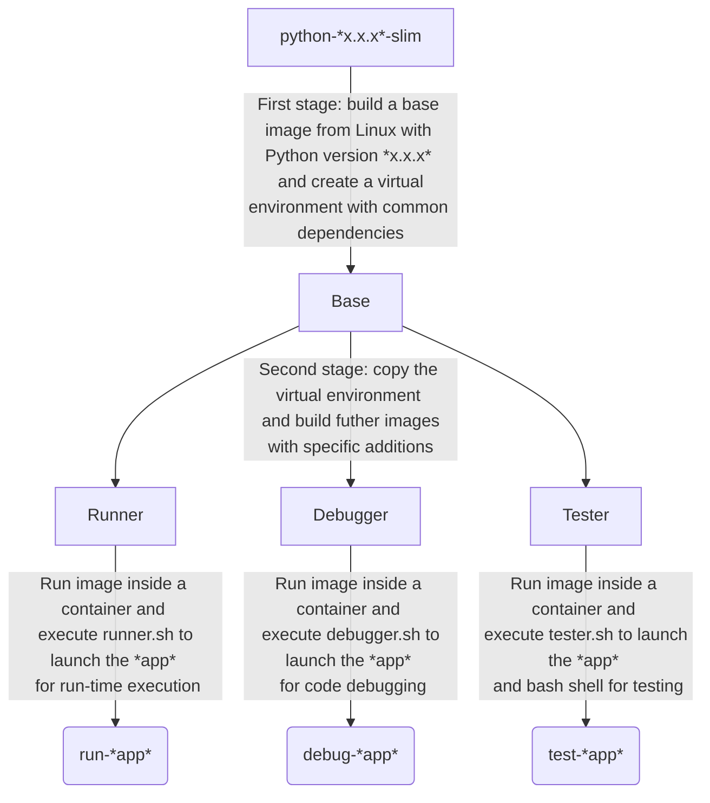
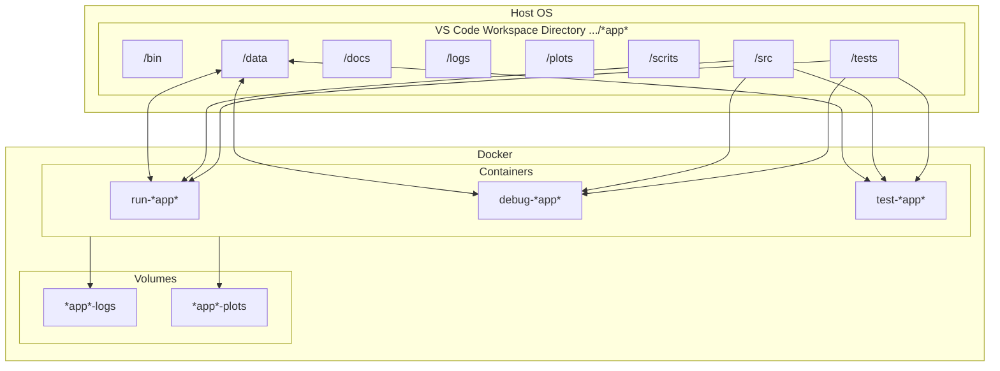

# Python Package Template

This is a template repository for Python packages.

The goal is to encapsulate a Python development ecosystem that encourages test-driven and continuous code integration with uniform format and type safety.

Python is an interpreted language. Building Python packages does not necessarily involve compiling, which can be computationally intensive. Therefore, continuous integration can be carried out with the local machine, through either the host OS or a Linux-based Docker container. In here, a pipeline goes automatically through a series of checks and unit tests before commiting or pushing code to the remote repository.

The build system orchestrates the various tools for continuous integration.

The development ecosystem in this repository comprises the following toolchain:

- The project dependencies are managed with *Poetry*
- The project Python version is managed with *Pyenv* (\*)
- The code is linted with *Flake8*
- The code formatting is enforced with *Black*
- The code is unit-tested with *pytest*
- The code type safety is statically analysed with *MyPy* (\*\*)
- Code checks above are hooked to every Git commit
- Unit tests and test coverage checks are hooked to every Git push (\*\*\*)
- Documentation can be automatically generated from the code with *Sphinx*
- The project is containerized with *Docker* and multi-stage image
- The project IDE is *VS Code* pre-configured for the whole toolchain

(\*) Not used in the Docker container, whose custom Linux image is tied to the Python version (i.e., 3.10.2 by default)

(\*\*) The static checker is configured to return errors as warnings, so that it does not break the pipeline

(\*\*\*) Unit testing can be the most complex stage of the pipeline and, thus, it might be too intensive to repeat at every commit

## 1. Repository Setup

The following steps are to create a new repository from this template:

- Create a new empty repository named <mynewrepo> at </url/of/my/new/repo>

- Run the following commands to clone the template repository:

      git clone https://github.com/giacomopj/py-package-template.git <mynewrepo>

  * and keep the commit history:

        cd <mynewrepo>
        git remote set-url origin </url/of/my/new/repo>
        git push -u origin master

  * and cancel the commit history:

        cd <mynewrepo>
        git rm -rf .git
        git init .
        git remote set-url origin </url/of/my/new/repo>
        git add .
        git commit -m "First commit"
        git push -u origin master

## 2. Installation

The toolchain of the Python echosystem can be installed either in the host OS (within a virtual environment) or in a Docker container or, preferably, in both.
On the one hand, it is more covenient to have the stages of the continuous integration pipeline automatically executed at every Git commit and push in the host OS, in which the code editor (i.e., VS Code) is used (\*).
On the other hand, the Docker container can be used to run and debug the application in a custom Linux image, in which any dependency issue has been already fixed.

(\*) Therefore, it is recommended to complete the installation in the host OS, even in case Poetry fails to install one or more dependencies. If such case, the installation can be completed anyway, although the lack of dependencies prevents the host OS from running and debugging the application withut Docker. In fact, some installation steps are still useful:

* to automatically run all code checks at every Git commit and push

* to set and select the Python version of the local environment (VS Code requires this setting even if it debugs the code on a Docker container)

### 2.1. Host OS Installation

The following steps are to install the Python ecosystem in the host OS:

- Install Git

- Install Pyenv and one or more stable versions of Python with Pyenv

- Install Poetry

- Install VS Code with Pylance extension

- Setup the repository (see Repository Setup)

- Set Python version <x.x.x> (e.g., 3.10.2) for the local workspace:

      pyenv local <x.x.x>

- Use the local-workspace Python version to be used inside the virtual environment:

      poetry env use python

- Install all dependencies in the virtual environment:

      poetry install
      poetry update

- Activate the virtual environment:

      poetry shell

- Set pre-commit and pre-push hooks:

      pre-commit install -t pre-commit
      pre-commit install -t pre-push

- Run all code pre-commit checks (optional):

      pre-commit run --all-files

- Run all unit tests and check test coverage (optional):

      pytest
      pytest --cov --cov-fail-under=90

- Run VS Code from inside the virtual environment:

      code .

- Inside VS Code open the command palette (ctrl+shift+P) and look for “Python:Select Interpreter”

- Select the path of the local-workspace Python version set with Pyenv

- Press "Terminal" from Debug and Run to launch the application in the host OS (optional)

References:

* https://cookiecutter-hypermodern-python.readthedocs.io/en/2020.11.15/guide.html#how-to-run-your-code
* https://mitelman.engineering/blog/python-best-practice/automating-python-best-practices-for-a-new-project/#why-run-checks-before-commit

### 2.2. Container Installation

The following steps are to build the custom Linux image hosting the development ecosystem and run it inside one or more Docker containers:

- Install Git

- Install Docker

- Install VS Code with Pylance and Docker extensions

- Setup the repository (see Repository Setup)

- Inside VS Code open the command palette (ctrl+shift+P) and look for “Python:Select Interpreter”

- Select the path of the Python version installed on the host OS (or the one of the local workspace, see host OS Installation)

- Press "Docker Runner" from Debug and Run to launch the application in a container (optional)

## 3. Template Design

The template is designed to match the directory structure and the configuration of VS Code interactions with Docker. These scripts should speed up the development as well as the handling of input/output files to and from the running containers.

### 3.1. Directory Structure

The root directory and the hidden folders therein shall contain only configuration files for the toolchain.

**/bin**

This folder is meant to contain executable binary files.

**/data**

This folder is meant to contain data files.

> The content of this folder is ignored by Git

**/docs**

This folder is meant to contain source code documentation.

**/logs**

This folder is meant to contain log files.

> The content of this folder is ignored by Git

**/plots**

This folder is meant to contain output plots.

> The content of this folder is ignored by Git

**/resources**

This folder is meant to contain relevant files such as:

- Images
- Spreadsheets
- Presentations
- Papers
- Datasheets
- Etc.

**/scripts**

This folder is meant to contain scripts for:

- Generating plots
- Sorting data files
- Filtering log files
- Etc.

**/src**

This folder is meant to contain the source code of one or more modules or a package ore a library.

    Python modules are executable .py scripts

    A Python package
    - is a collection of modules organized in a folder
      that contains __init__.py
    - can be made of multiple sub-packages (see /src/a and /src/b sub-folders)
    - can be made executable as a script by providing __main__.py
      which imports the package as a module

    A Python library is a collection of packages

**/tests**

This folder is meant to contain unit tests.

> The structure of this folder shall mirror the sub-packages in the source code

## 3.2. Docker and VS Code

A Dockerfile is provided to assemble a two-stage image, which can build three slightly different images from the same Base image:

1. Runner - to simply run the application
2. Debugger - to debug the code
3. Tester - to access the bash shell for testing, document generation, etc.

Each of these image runs a distinct container that executes a dedicated script at start-up; runner.sh, debugger.sh, and tester.sh, respectively.

The following graph represents the Dockerfile, in which:

* \*x.x.x\* is the Python version (i.e., 3.10.2 by default) for the Linux-based Base image

* \*app\* is the name of the folder containing the repository, which is also the workspace directory opened with VS Code

### Build and Run

These three images can be run from Run and Debug in VS Code, either with or without re-building.

Note that any build is time-consuming and requires Internet connection. A fresh build is necessary only when changing the Dockerfile or the dependencies of the virtual environment.

### Input/Output Files

Files are handled in two different ways.

1. Files in the following folders within the host OS workspace directory are automatically synchronised to the homonymous folders inside the running containers, without the need to re-build the Docker image:
   * **/data** - data can be added/modified/removed by both the host OS and the containers
   * **/src** - source code in the container is up-to-date with the code in the host OS workspace directory
   * **/tests** - unit testing code in the container is up-to-date with the code in the host OS workspace directory

2. Files in following folders of the running containers are made available in Docker as volumes, from which they can be moved to the host OS:
   * **/logs** - logs produced inside the container are stored in the volume \*app\*-logs
   * **/plots** - plots produced inside the container are stored in the volume \*app\*-plots

The following flowchart shows the input and output files to and from the containers

References:

* https://code.visualstudio.com/docs/remote/containers

## 4. How To

- How to keep up-to-date with this template any branch <branchname> (e.g., master) of any repository based on this template

      git remote add template https://github.com/giacomopj/py-package-template.git
      git fetch --all
      git merge template/<branchname> --allow-unrelated-histories

  Merging the updates inevitably causes a number of conflicts (in README.md, pyproject.toml, etc.) that have to be resolved manually

- How to add a new dependency <newdependency> (e.g., a Python library) to the ecosystem:

      poetry add <newdependency>
      git add pyproject.toml
      git add poetry.lock
      git commit -m "Added <newdependency>"

  Adding a dependency requires re-building the Docker image to become effective

- How to generate automatic documentation from the code in a specific format <myformat> (e.g. html) (\*):

      sphinx-build -b <myformat> src/ docs/<myformat>/

  (\*) If it is not executable from the host OS, this command might be excuted from the bash shell within a container (e.g., Tester image)

- How to commit and push code without pre-commit hooks:

      git commit -m "<mymessage>" --no-verify
      git push --no-verify
      
- How to revert uncommitted changes tin tracked files
      
      git reset -hard
      
- How to delete untracked local files and folders
      
      git clean -fxd
      
- How to remove all stopped Docker containers
      
      docker container prune
      
 - How to remove all unused Docker images and volumes
      
      docker system prune -y -a --volumes
