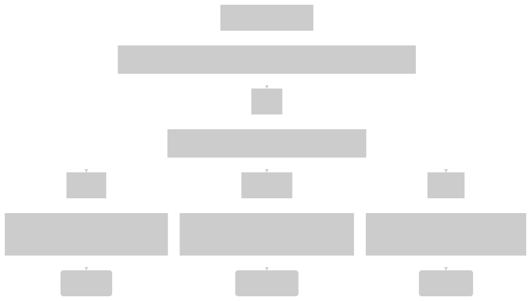

=======================
Python Package Template
=======================

This is a template repository for Python packages.

The goal is to encapsulate a Python development ecosystem that encourages test-driven and continuous code integration with uniform format and type safety.

Python is an interpreted language. Building Python packages deos not necessarily involve compiling, which can be computationally intensive. Therefore, continuous integration can be carried out with the local machine, through either the host OS or a Linux-based Docker container. In here, a pipeline goes automatically through a series of checks and unit tests before commiting or pushing code to the remote repository.

The build system orchestrates the several tools for continuous integration.

The development ecosystem in this repository comprises the following toolchain:

- The project dependencies are managed with *Poetry*
- The project Python version is managed with *Pyenv* (\*)
- The code is linted with *Flake8*
- The code formatting is enforced with *Black*
- The code is unit-tested with *pytest*
- The code type safety is statically analysed with *MyPy* (\*\*)
- Code checks above are hooked to every git commit
- Unit tests and test coverage checks are hooked to every git push (\*\*\*)
- Documentation can be automatically generated from the code with *Sphinx*
- The project is containerized with *Docker* and multi-stage builds
- The project IDE is *VS Code* pre-configured for the whole toolchain

(\*) Not used in the Docker container, whose custom Linux image is tied to the Python version passed as parameter (i.e., 3.10.2 by default)

(\*\*) The static checker is configured to return errors as warnings, so that it does not break the pipeline

(\*\*\*) Unit testing can be the most complex stage of the pipeline and, thus, it might be too intensive to repeat at every commit

Repository Setup
================

The following steps are to create a new repository from this template:

- Create a new empty repository named <mynewrepo> at </url/of/my/new/repo>

- Run the following commands to clone the template repository::

      git clone https://github.com/giacomopj/py-package-template.git <mynewrepo>

  * and keep the commit history::

        cd <mynewrepo>
        git remote set-url origin </url/of/my/new/repo>
        git push -u origin master

  * and cancel the commit history::

      cd <mynewrepo>
      git rm -rf .git
      git init .
      git remote set-url origin </url/of/my/new/repo>
      git add .
      git commit -m "First commit"
      git push -u origin master

Installation
============

The toolchain of the Python echosystem can be installed either in the host OS (within a virtual environment) or in a Docker container or, preferably, in both.
On the one hand, it is more covenient to have the stages of the continuous integration pipeline automatically executed at every git commit and push in your host OS, in which the code editor (i.e., VS Code) is used (\*).
On the other hand, the Docker container can be used to run and debug the application in a custom Linux image, in which any dependency issue has been already fixed.

(\*) Therefore, it is recommended to complete the installation in the host OS, even if Poetry fails to install some dependencies. This is necessary because

* all code checks are run at every Git commit and push command from the host OS terminal

* debugging the code through a Docker container still requires to set and select the Python version of the local envrionement in VS Code

Host OS Installation
--------------------

The following steps are to install the Python ecosystem in your host OS:

- Install Git

- Install Pyenv and one or more stable versions of Python with Pyenv

- Install Poetry

- Install VS Code with Pylance extension

- Setup the repository (see Repository Setup)

- Set Python version <x.x.x> (e.g., 3.10.2) for the local workspace::

      pyenv local <x.x.x>

- Use the local-workspace Python version to be used inside the virtual environment::

      poetry env use python

- Install all dependencies for the virtual environment::

      poetry install
      poetry update

- Activate the virtual environment::

      poetry shell

- Set pre-commit and pre-push hooks::

      pre-commit install -t pre-commit
      pre-commit install -t pre-push

- Run all code pre-commit checks (optional)::

      pre-commit run --all-files

- Run all unit tests and check test coverage (optional)::

      pytest
      pytest --cov --cov-fail-under=100

- Run VS Code from inside the virtual environment::

      code .
      
- Inside VS Code open the command palette (ctrl+shift+P) and look for “Python:Select Interpreter”

- Select the path of the local-workspace Python version set with Pyenv

- Press "Terminal" from Debug and Run to launch the application in your OS (optional)

References:

* https://cookiecutter-hypermodern-python.readthedocs.io/en/2020.11.15/guide.html#how-to-run-your-code
* https://mitelman.engineering/blog/python-best-practice/automating-python-best-practices-for-a-new-project/#why-run-checks-before-commit

Container Installation
----------------------

The following steps are to build the custom Linux image hosting the development ecosystem and run it inside one or more Docker containers:

- Install Git

- Install Docker

- Install VS Code with Pylance and Docker extensions

- Setup the repository (see Repository Setup)

A Docker file is provided to assemble a multi-stage image, which consists of three stages from the same base stage:

#. Debugger
#. Runner
#. Tester

 .. image:: docker_graph.png
   :width: 200px
   :height: 100px
   :scale: 50 %
   :alt: alternate text
   :align: right

The stages Debugger and Runner can be build and run into a Docker container from Debug and Run in VS Code:

- Press "Docker Runner" configuration to launch the application (\*)

- Press "Docker Debugger" configuration to debug the application (\*)

The stage Tester can be build and run into a Docker container from command line (\*) and it executes the script /scripts/start-up.sh (\*\*)::

      docker build --target=tester -t test-app --build-arg CONTEXT=test .
      docker run --rm -it test-app

(\*) All image stages can be built and run from command line::

    docker build --target=runner -t run-app .
    docker run --rm -it run-app

From command line is also possible to pass the Python version <x.x.x> (i.e., 3.10.2 by default) as a parameter::

    docker build --target=debugger -t debug-app --build-arg PYTHON_VERSION=<x.x.x> .
    docker run --rm -it --expose 5678 debug-app

(\*\*) This sample script performs all pre-commit and pre-push checks, launches the application, and opens the container root shell for testing purposes

References:

* https://code.visualstudio.com/docs/remote/containers

How To
======

- How to add a new dependency <newdependency> (e.g., a Python library) to the ecosystem::

      poetry add <newdependency>
      git add pyproject.toml
      git add poetry.lock
      git commit -m "Added <newdependency>"

- How to generate automatic documentation from the code in a specific format <myformat> (e.g. html) (\*)::

      sphinx-build -b <myformat> src/ docs/<myformat>/

  (\*) If it is not executable from the host OS, this command shall be excuted within the Docker container for the Tester stage

- How to commit and push code without pre-commit hooks::

      git commit -m "<mymessage>" --no-verify
      git push --no-verify

- How to cleanup unused images and dangling ones::

      docker system prune -a

- How to cleanup dangling images::

      docker image prune

Folder Tree
===========

The root directory and the hidden folders therein shall contain only configuration files for the toolchain.

Bin
---

This folder is meant to contain executable binary files.

Data
----

This folder is meant to contain data files.

Docs
----

This folder is meant to contain source code documentation.

Logs
----

This folder is meant to contain log files.

Plots
-----

This folder is meant to contain output plots.

Resources
---------

This folder is meant to contain relevant files such as:

- Images
- Spreadsheets
- Presentations
- Papers
- Datasheets
- Etc.

Scripts
-------

This folder is meant to contain scripts for:

- Generating plots
- Sorting data files
- Filtering log files
- Etc.

Src
---

This folder is meant to contain the source code of one or more modules or a package ore a library.

 > Python modules are executable .py scripts

 > A Python package

 * is a collection of modules organized in a folder
   that contains __init__.py
 * can be made of multiple sub-packages (see /src/a and /src/b sub-folders)
 * can be made executable as a script by providing __main__.py
   which imports the package as a module

 > A Python library is a collection of packages

Tests
-----

This folder is meant to contain unit tests.

 > The tree of this folder shall mirror that of the source code
